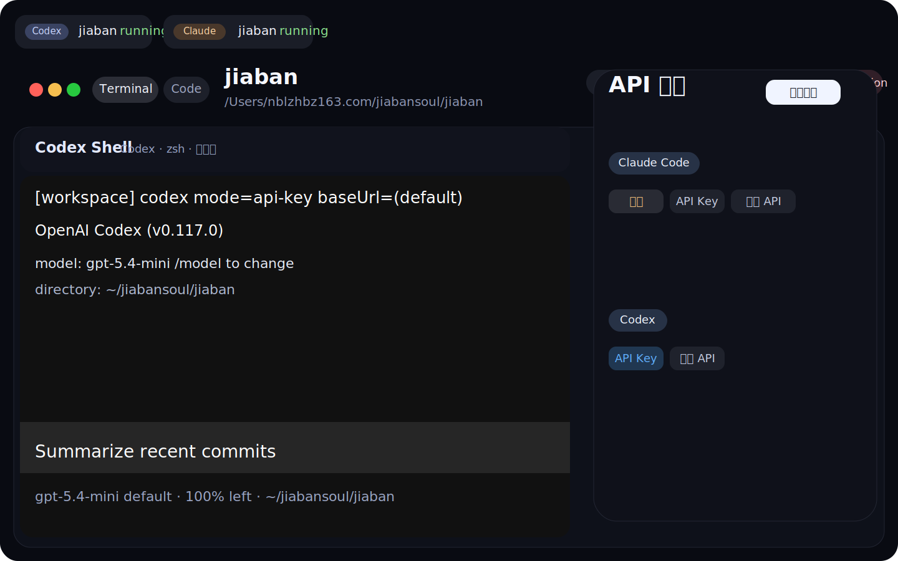
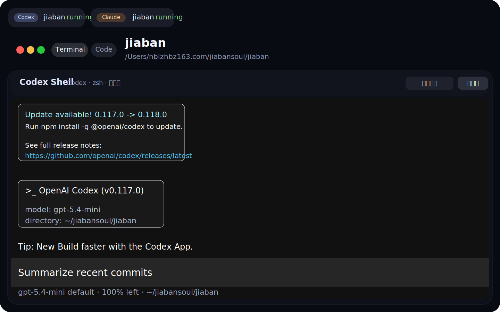
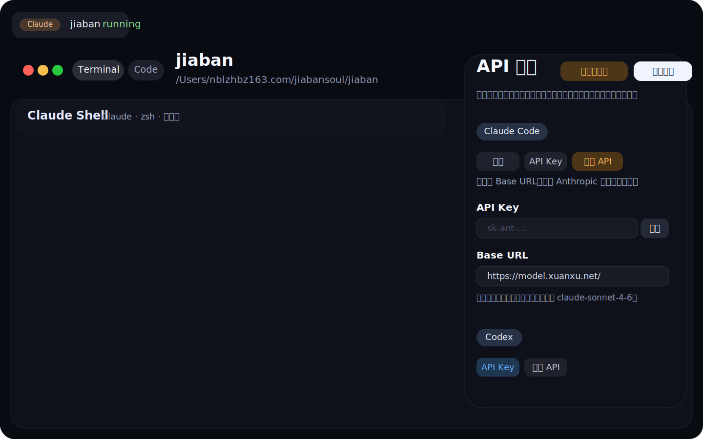

# 甲班 Jiaban

> 一个把 Claude Code 和 Codex 收进同一套桌面工作流的 AI 编程工作台。

Jiaban 不是普通的终端壳子，也不是把网页简单包成桌面应用。
它要做的是把 AI 会话、工作目录、代码视图、API 配置、环境安装和 CLI 安装放进同一个桌面工作区里，让开发者能持续地在一个地方推进任务。

## 这项目是干什么的

如果你平时会同时开 Claude Code、Codex、Terminal、Finder、编辑器和一堆配置文件，那工作流通常会有几个明显问题：

- 会话一多，终端窗口很快就乱掉。
- 不同 AI 工具的 API、目录、CLI 安装状态分散在不同地方。
- 切换任务时，很难把“会话 + 目录 + 配置 + 上下文”一起带走。
- 现有工具大多只解决单点问题，不像一个完整的桌面工作台。

Jiaban 想解决的，就是把这些本来割裂的操作整合成一个更顺手的 AI 编程桌面。

## 核心能力

- 灵动岛入口：顶部胶囊式状态入口，用来收纳当前会话状态和控制面板。
- 多会话工作区：同一个工作区下同时管理多个 Claude / Codex 会话。
- 持续终端会话：每个会话都是真实 PTY 终端，不是假的聊天页，切换回来仍然保持运行状态。
- 标签式终端管理：不同会话可独立存在、独立切换，也可以统一打开整个 workspace。
- 目录与代码联动：目录、代码、终端围绕同一个项目工作，而不是互相割裂。
- API 配置面板：集中管理 Claude Code / Codex 的 API Key、Base URL、订阅模式等配置。
- 保存并重启：修改配置后可直接重启当前会话，让新配置即时生效。
- 环境安装：用于检查并安装 Node.js、pnpm、git 等运行环境。
- CLI 安装：用于安装 Claude Code 和 Codex CLI。
- 桌面端形态：当前以 Electron + Vue + TypeScript 构建，优先服务真实桌面工作流。

## 界面预览

### 1. 工作台总览



多会话标签、终端工作区、目录信息和 API 面板被集中在一个桌面工作流里。

### 2. Codex 会话视图



会话不是重新载入的静态页面，而是保留上下文和运行状态的真实终端会话。

### 3. API 配置面板



Claude Code 和 Codex 的配置集中管理，保存后可直接重启当前会话生效。

## 当前已经做了什么

目前仓库主体验已经围绕下面这些能力展开：

- 顶部灵动岛式入口与展开面板
- Claude / Codex 多会话切换
- Terminal / Code 双视图工作区
- 工作目录切换与会话联动
- Claude / Codex API 配置管理
- 环境检查与 CLI 检查
- macOS / Windows 启动脚本

## 适合谁

- 同时使用 Claude Code 和 Codex 的开发者
- 想把 AI 编程流程收进统一桌面工作台的人
- 不想在 Finder、Terminal、CLI、配置文件之间反复跳转的人

## 仓库结构

- `apps/desktop`
  当前桌面应用主程序，包含 Electron 主进程、渲染进程和工作区界面。
- `packages/*`
  项目使用到的共享协议、运行时、UI、i18n、Electron 辅助能力等。
- `docs/images`
  README 中使用的界面预览图。
- `start.command`
  macOS 启动脚本。
- `start.bat`
  Windows 启动脚本。

## 快速开始

首次拉取后先安装依赖：

```bash
pnpm install
```

本地开发启动：

```bash
pnpm dev
```

## 启动方式

- macOS：运行 [start.command](./start.command)
- Windows：运行 [start.bat](./start.bat)

## 构建

```bash
pnpm build
```

或单独构建桌面端：

```bash
pnpm --dir apps/desktop build
```

## 开发说明

- 桌面端技术栈：Electron + Vue + TypeScript
- 包管理器：pnpm workspace
- 当前主要入口：`apps/desktop`
- 当前项目定位：以桌面端 AI 编程工作流为核心，不是通用聊天产品

## 作者

梁宗靖

## 法律与说明

- 项目版权说明：[COPYRIGHT.md](./COPYRIGHT.md)
- 第三方说明：[THIRD_PARTY_NOTICES.md](./THIRD_PARTY_NOTICES.md)
- 仓库许可证：[LICENSE](./LICENSE)
